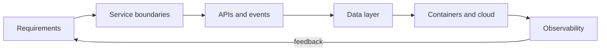

<div align="center">


<a href="https://git.io/typing-svg">
  
</a>

<br/><br/>

<a href="https://linkedin.com/in/essemmkayy"></a>
<a href="https://twitter.com/essemmkayy"></a>
<a href="https://instagram.com/essemmkayy"></a>
<a href="mailto:mhaider@technologyrivers.com"></a>
<a href="https://github.com/tr-mhaider?tab=followers"></a>

</div>

<br/>

<div align="center">

## `> whoami`

</div>

```ts
const syed = {
  role:      "Backend & Infrastructure Engineer",
  location:  "Pakistan",
  focus:     ["Architecture", "System Design", "Scalability"],
  building:  ["Backend services", "APIs", "Distributed systems"],
  infra:     ["Cloud", "Containers", "Observability"],
  openTo:    ["Collaborations", "System design chats", "Open source"],
  contact:   "mhaider@technologyrivers.com",
};
```

<br/>

<div align="center">

## `> core expertise`

<table>
<tr>
<td align="center" width="25%">

<br/><br/>
<b>System Design</b>
<br/>
<sub>Service boundaries, scalable patterns, clear trade-offs</sub>
</td>
<td align="center" width="25%">

<br/><br/>
<b>Services and APIs</b>
<br/>
<sub>High-throughput backends, event-driven and distributed systems</sub>
</td>
<td align="center" width="25%">

<br/><br/>
<b>Infrastructure</b>
<br/>
<sub>Containers, orchestration, cloud native deployments</sub>
</td>
<td align="center" width="25%">

<br/><br/>
<b>Observability</b>
<br/>
<sub>Metrics, logging, tracing, SLOs, incident response</sub>
</td>
</tr>
</table>

</div>

<br/>

<div align="center">

## `> how I think about systems`



</div>

<br/>

<div align="center">

## `> tech stack`

**Backend and Runtimes**


**Data and Messaging**


**Cloud and Infrastructure**


**Observability and Delivery**


**Frontend and Mobile (when needed)**


</div>

<br/>

<div align="center">

## `> let's talk architecture`

<a href="mailto:mhaider@technologyrivers.com"></a>

<br/><br/>


</div>
